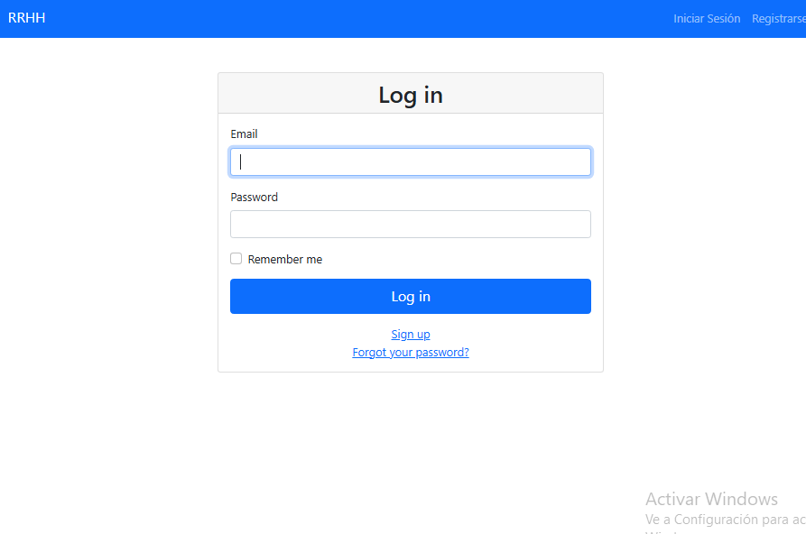

# Sistema de Gestión de Recursos Humanos

## Descripción del Proyecto
El Sistema de Gestión de Recursos Humanos permite gestionar empleados, horarios y usuarios de manera eficiente y efectiva.

## Capturas de Pantalla del Proyecto
### Home


### Login


### Nuevo Empleado


### Empleados


### Detalles del Empleado


## Prerrequisitos o Dependencias a Instalar
- Ruby 2.7.2
- Rails 6.1.4
- PostgreSQL

## Instalación del Proyecto
1. Clonar el repositorio:
    ```bash
    git clone https://github.com/tu_usuario/gestion_recursos_humanos.git
    cd gestion_recursos_humanos
    ```

2. Instalar las dependencias:
    ```bash
    bundle install
    ```

3. Comando para cargar la Base de Datos o Migrar los Modelos:
    ```bash
    rails db:migrate
    ```

4. Comando para cargar los Datos Semilla a la Base de Datos:
    ```bash
    rails db:seed
    ```

## 2. Add Screenshots
1. Create a `screenshots` directory in the project root.
2. Add the following images:
   - `home.png`
   - `login.png`
   - `empleado_nuevo.png`
   - `empleados.png`
   - `empleado_id.png`

## 3. Commit and Push Changes
```bash
git add README.md screenshots/
git commit -m "Add README.md and screenshots"
git push origin main
```

## Credenciales de acceso según Tipo de Usuario luego de cargar los datos semilla
Para Usuario Tipo Administrador:
- Email: administrador@mail.com
- Contraseña: Abc123#

Para Usuario Tipo Usuario:
- Email: usuario@mail.com
- Contraseña: Abc123#
